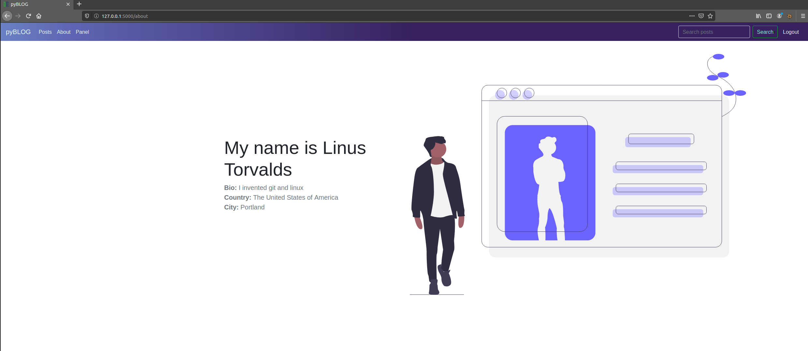
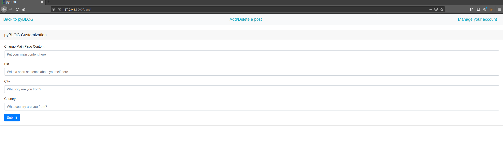

# pyBLOG
A lightweight Flask blog
- blog project I made to learn how to use SQL

## Installation and setup

```bash
$ cd /opt/
$ git clone https://github.com/Akshay-Rohatgi/pyBLOG
$ cd pyBlog
$ bash install.sh
```

`install.sh` should do most of the work for you, afterwards you can can just `python3 app.py` and your server should be up

### Default Credentials:
- Username: `admin_default`
- Password: `default_pass`

Please change these from the admin panel when you first get on.

### Future of this project:
- session handling needs more work and could probably be flask pickled or somehow reversed
- SQLi *might* be possible 
- more customization

### Some screenshots showcasing the app:

### Main page


### About page


### Admin panel (please no bully)
